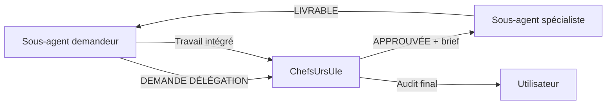

# Matrice de délégation inter-agents (accord ChefsUrsUle)

**Orchestrateur** : [ChefsUrsUle](../../../../.skills/ChefsUrsUle/SKILL.md)  
**Manifeste global** : [skills_manifest.md](../../../../.skills/ChefsUrsUle/references/skills_manifest.md)

> Aucun sous-agent ne délègue directement à un autre **sans accord explicite de ChefsUrsUle**.  
> ChefsUrsUle peut approuver, modifier le brief ou refuser la demande.

---

## Protocole en 4 étapes

### 1. Détection (sous-agent demandeur)

Si une **partie** du travail dépasse la spécialité du demandeur, il **s'arrête** sur ce volet et émet :

```markdown
[DEMANDE DÉLÉGATION → ChefsUrsUle]

- **Agent demandeur** : {mon-nom}
- **Agent cible proposé** : {agent-spécialiste}
- **Périmètre délégué** : [partie précise du travail — pas la tâche entière sauf general-purpose]
- **Périmètre conservé** : [ce que je continue moi-même]
- **Justification** : [pourquoi le spécialiste est plus adapté]
- **Livrable attendu du spécialiste** : [format, critères]
- **Dépendances** : [inputs nécessaires, fichiers, specs prompt/]
```

### 2. Décision (ChefsUrsUle)

ChefsUrsUle répond par **une** de ces formes :

| Réponse | Action |
|---------|--------|
| `[DÉLÉGATION APPROUVÉE]` | Émet un brief cible vers l'agent spécialiste |
| `[DÉLÉGATION MODIFIÉE]` | Change l'agent cible ou le périmètre, puis brief |
| `[DÉLÉGATION REFUSÉE]` | Le demandeur continue seul ou ChefsUrsUle reprend la main |

Brief d'approbation :

```markdown
[DÉLÉGATION APPROUVÉE — ChefsUrsUle]

- **Agent demandeur** : {agent-origine} (intègre le livrable)
- **Agent exécutant** : {agent-cible}
- **Manifeste exécutant** : skills-main/agents/manifests/{agent-cible}_manifest.md
- **Périmètre** : [tâche partielle exacte]
- **Retour vers** : {agent-origine} | ChefsUrsUle
- **Critères de validation** : [...]
```

### 3. Exécution (agent spécialiste)

L'agent cible n'exécute **que** le périmètre approuvé. Il retourne :

```markdown
[LIVRABLE DÉLÉGATION]

- **Pour** : {agent-demandeur}
- **Contenu** : [...]
- **Fichiers touchés** : [...]
- **Suite suggérée** : [intégration par le demandeur]
```

### 4. Intégration (agent demandeur ou ChefsUrsUle)

Le demandeur fusionne le livrable dans son travail global. ChefsUrsUle valide en fin de chaîne (sécurité, design, tests).

---

## Matrice : qui peut proposer de déléguer à qui

| Agent demandeur | Peut proposer délégation vers | Cas typiques |
|-----------------|------------------------------|--------------|
| **general-purpose** | Tous les 5 spécialistes | Toute sous-tâche hors périmètre généraliste |
| **mermaid-diagram-specialist** | codebase-pattern-finder, ui-ux-designer, communication-excellence-coach | ERD depuis code existant ; parcours UX ; doc stakeholder |
| **ui-ux-designer** | ascii-ui-mockup-generator, codebase-pattern-finder, mermaid-diagram-specialist | Wireframes ASCII ; patterns UI repo ; flux utilisateur |
| **codebase-pattern-finder** | mermaid-diagram-specialist, general-purpose | Visualiser archi trouvée ; tâche élargie au-delà recherche |
| **ascii-ui-mockup-generator** | ui-ux-designer, codebase-pattern-finder, mermaid-diagram-specialist | Revue UX post-maquette ; layouts existants ; flows multi-écrans |
| **communication-excellence-coach** | mermaid-diagram-specialist, general-purpose | Schémas pour slides ; projet comm multi-livrables |

### Interdictions

- Aucun spécialiste ne délègue à **general-purpose** sauf **codebase-pattern-finder** et **communication-excellence-coach** (tâche trop large).
- Aucune délégation en chaîne (A → B → C) sans **nouvelle approbation** ChefsUrsUle à chaque maillon.
- Le demandeur ne délègue **jamais** la validation finale ni la conformité `SECURITY.md` / `DESIGN_SYSTEM.md` — réservé à ChefsUrsUle.

---

## Diagramme



---

## Références par agent

| Agent | Manifeste |
|-------|-----------|
| general-purpose | [general-purpose_manifest.md](general-purpose_manifest.md) |
| mermaid-diagram-specialist | [mermaid-diagram-specialist_manifest.md](mermaid-diagram-specialist_manifest.md) |
| ui-ux-designer | [ui-ux-designer_manifest.md](ui-ux-designer_manifest.md) |
| codebase-pattern-finder | [codebase-pattern-finder_manifest.md](codebase-pattern-finder_manifest.md) |
| ascii-ui-mockup-generator | [ascii-ui-mockup-generator_manifest.md](ascii-ui-mockup-generator_manifest.md) |
| communication-excellence-coach | [communication-excellence-coach_manifest.md](communication-excellence-coach_manifest.md) |
